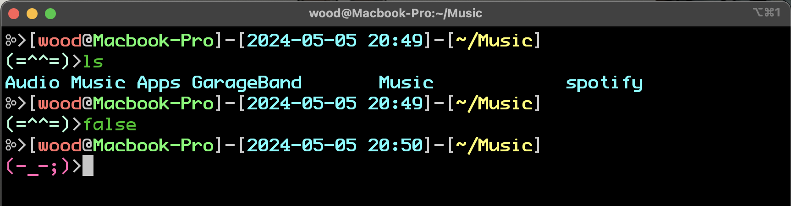

# firmine

firmine is a simple, lightweight ZSH theme that uses [Kaomoji](https://en.wikipedia.org/wiki/Kaomoji "Wikipedia") to denote success and failure.

## Installation

#### **oh-my-zsh**

Place the `firmine.zsh-theme` in `~/.oh-my-zsh/custom/themes/`

Set `ZSH_THEME="firmine"` in your `.zshrc`
